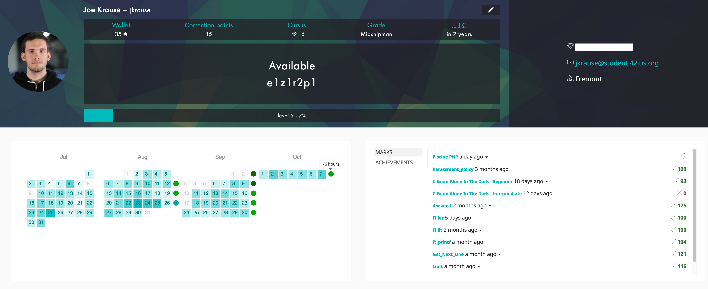

# Check Your Dorms
A userscript / chrome extension (soon) to check your eligibility to stay in the dorms.

This combines the total hours in the week (from Sunday to Saturday) and produces 

# Installing

- If you have Tampermonkey installed, click on the script: [checkyourdorms.user.js](checkyourdorms.user.js) and click on "Raw".  A prompt will appear and you can install it.

- If you don't, you can install the chrome extension by clicking on the extension: [chrome_ext.crx](chrome_ext.crx) and click on Download.  After that, you will want to navigate to `chrome://extensions` and drag the downloaded crx file in there.

- If you don't trust me (most people don't, spoiler alert), you can compile the said script yourself by using Chrome's Developer tools and pack the [chrome_ext](chrome_ext) directory.  The symlink to content_script.js is intentional to prevent issues.

### Contributing

My rules are simple.  Send a pull request, I'll check it out when I can.
